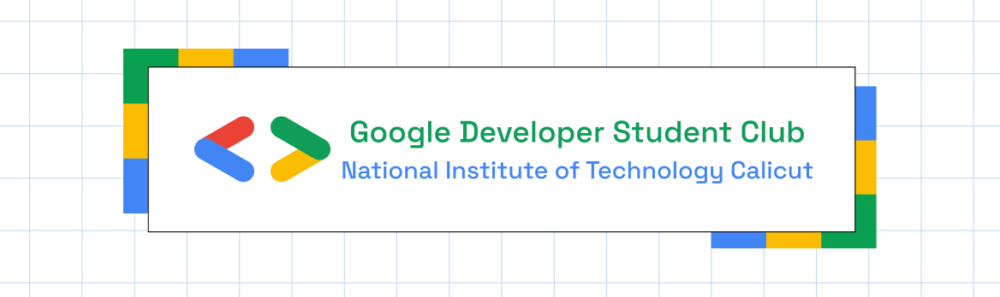
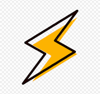

<p align="center">
<a href="https://gdscnitc.in">
	
</a>
	<div align="center" style="display: flex; align-items: center; justify-content: center; gap: 12px;">
		
		<h2>QuickNav – Chrome Extension</h2>
	</div>
	<h4 align="center">Keyboard Shortcuts for Chrome, Built for Productivity</h4>
 	<p>QuickNav is designed for anyone who values speed and efficiency in their web browsing. Whether you’re a developer, student, or professional, QuickNav lets you access your most-used sites with just a few keystrokes. No more typing out long URLs or searching through bookmarks—just type your shortcut and go. With group support, you can launch your entire workflow in seconds, making QuickNav the perfect companion for anyone who wants to get more done in less time.
</p>

[](https://www.instagram.com/gdsc_nitc/)
[](INSERT_LINK_FOR_DOCS_HERE)
[](https://youtube.com/shorts/cOEFKwnOA_M?si=x3KEl_Op-YBLZOrU)

---

## ✨ Features

- **Instant Navigation with Shortcuts:**  
  Map your favorite URLs to custom keyboard shortcuts. Type your keyword in the Chrome address bar and jump to any site instantly.
- **Group Shortcuts:**  
  Create groups of shortcuts that open multiple tabs at once. Launch your workflow with a single command, like `:work` or `:social`.
- **Drag-and-Drop Group Creation:**  
  Build groups by dragging and dropping shortcuts into your custom group area. Managing your daily routine has never been easier.
- **Persistent Storage & Sync:**  
  All shortcuts and groups are saved and synced across your Chrome browsers, so your workflow stays consistent everywhere.
- **Minimal, User-Friendly UI:**  
  Clean, modern interface with smooth animations and dark mode support. Focus on what matters—getting things done fast.
  


<div align="center" style="display: flex; align-items: center; justify-content: center; width:100%">
	
	

</div>

## 💻 Tech Stack

- **React**: Builds the popup UI with animations and state management.
- **TypeScript**: Ensures type safety and maintainability.
- **Tailwind CSS**: Provides utility-first, responsive styling.
- **Framer Motion**: Adds delightful animations and transitions.
- **Chrome Extension APIs**: Powers omnibox shortcuts and background scripts.

## 🛠 Dependencies

- **React**: UI development.
- **TypeScript**: Type checking and modern JavaScript features.
- **Tailwind CSS**: CSS framework.
- **Framer Motion**: Animations.
- **Heroicons**: Beautiful, consistent icons for UI elements.
- **Vite**: Fast, modern build tool for development and production.


## 🔌 How to Load an Unpacked Chrome Extension

1. **Open Google Chrome**  
   Launch your Chrome browser.

2. **Go to the Extensions Page**  
   - Click the **three-dot menu** in the top-right corner.  
   - Navigate to:  
     `More Tools` → `Extensions`  
   - Or directly enter this URL in the address bar:  
     ```
     chrome://extensions/
     ```

3. **Enable Developer Mode**  
   - In the top-right corner of the Extensions page, toggle the **Developer mode** switch to ON.

4. **Click "Load unpacked"**  
   - A file dialog will appear.

5. **Select Your Extension Folder**  
   - Browse to the folder where your extension is located (it must contain the `manifest.json` file).  
   - Click **"Select Folder"** (on Windows/Linux) or **"Open"** (on macOS).

6. **Check for Errors**  
   - Chrome will try to load the extension.  
   - If there are any issues, you'll see error messages on the extension card. Click **"Errors"** to see details.

## 📝 Notes

- Make sure your folder includes a valid `manifest.json`.
- For **Manifest V3**, use a service worker instead of a background page.
- After editing your code, click **"Reload"** on the extension card to apply changes.

## CONTRIBUTORS

<table>
	<tr align="center">
		<td>
		Vinit Keshri
		<p align="center">
			
		</p>
        <p align="center">
            <a href = "https://github.com/vinitkesh">
                
            </a>
            <a href = "https://www.linkedin.com/in/vinitkeshri">
                
            </a>
        </p>
		</td>
	</tr>
</table>


**QuickNav is open-source, free, and ready to supercharge your browsing experience. Try it today and navigate the web faster than ever!**
